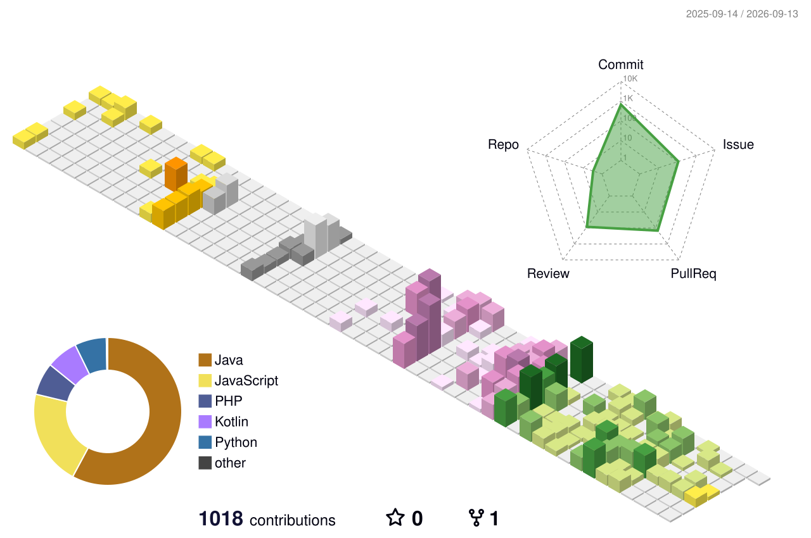
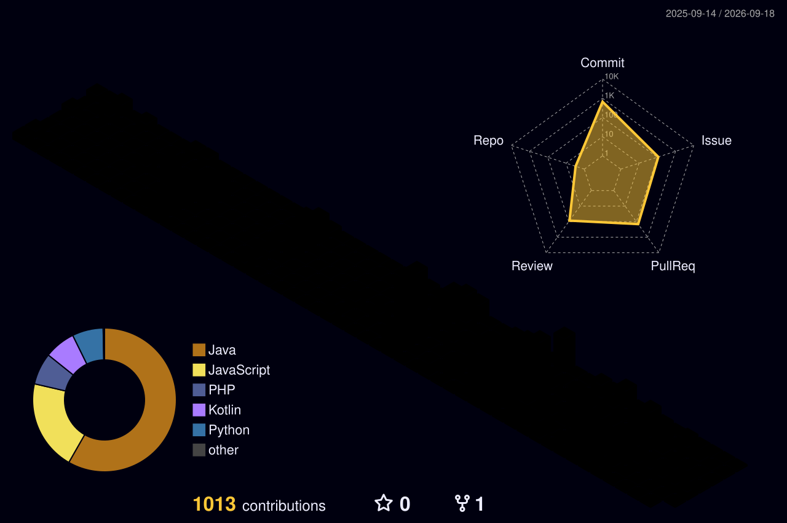
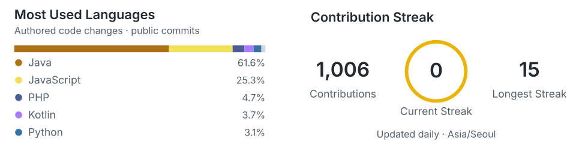
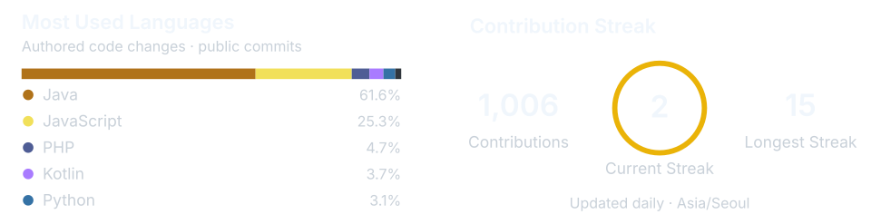

<!-- Header · GitHub light/dark theme-aware -->

<!-- 3D Contributions · Northern Hemisphere season -->

  

  <strong>🍞 ABOUT</strong> 
  manju + minju = deli-minju.
     
  <strong>📍 CURRENTLY</strong> 
  UMC 10th — PLIMAP (Spring Boot) 
  VCMI Lab. — Undergraduate Researcher 
  Dept. Dev Club — Committee (Node.js) 
  Graduation Project — GACHI (Python, Spring Boot)

 

## 🛠︎ Tech Stack

**Languages**

**Frameworks & Platforms**

**Database & Infrastructure**

 

<h2>
  
  GitHub Stats
</h2>

 

## 🐾︎ My Farm

  

 

<!-- Visitor counter -->

  

