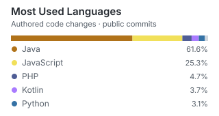
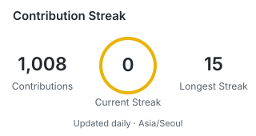

<!-- Header · theme-aware -->
<picture>
  <source media="(prefers-color-scheme: dark)" srcset="https://capsule-render.vercel.app/api?type=blur&color=0%3A0D1117%2C50%3A282312%2C100%3A4A3C12&height=180&section=header&text=minju.log&fontSize=46&fontColor=F0F6FC&animation=fadeIn&fontAlignY=42&desc=probably%20building%20something.&descSize=17&descAlignY=65" />
  <source media="(prefers-color-scheme: light)" srcset="https://capsule-render.vercel.app/api?type=blur&color=0%3AFFFDF2%2C50%3AFFF3C4%2C100%3AFFE69A&height=180&section=header&text=minju.log&fontSize=46&fontColor=24292F&animation=fadeIn&fontAlignY=42&desc=probably%20building%20something.&descSize=17&descAlignY=65" />
  
</picture>

<!-- 3D Contributions · Northern Hemisphere season -->

  <picture>
    <source media="(prefers-color-scheme: dark)" srcset="./profile-3d-contrib/profile-night-rainbow.svg" />
    <source media="(prefers-color-scheme: light)" srcset="./profile-3d-contrib/profile-season-animate.svg" />
    
  </picture>

  

  🍞 
  <strong>ABOUT</strong> 
  manju + minju = deli-minju.
     
  <strong>🔭 CURRENTLY</strong> 
  UMC 10th — PLIMAP (Spring Boot) 
  VCMI Lab. — Undergraduate Researcher 
  Dept. Dev Club — Committee 
  Graduation Project — GACHI (Python, Spring Boot)

 

## 🛠︎ Tech Stack

**Languages**

**Frameworks & Platforms**

**Database & Infrastructure**

 

<h2><picture><source media="(prefers-color-scheme: dark)" srcset="./assets/graph-dark.svg" /><source media="(prefers-color-scheme: light)" srcset="./assets/graph.svg" /></picture> GitHub Stats</h2>

  <picture>
    <source media="(prefers-color-scheme: dark)" srcset="./profile/top-languages-dark.svg" />
    <source media="(prefers-color-scheme: light)" srcset="./profile/top-languages.svg" />
    
  </picture>
  <picture>
    <source media="(prefers-color-scheme: dark)" srcset="./profile/streak-dark.svg" />
    <source media="(prefers-color-scheme: light)" srcset="./profile/streak.svg" />
    
  </picture>

 

## 🐾︎ My Farm

  

 

<!-- Visitor counter -->

  

